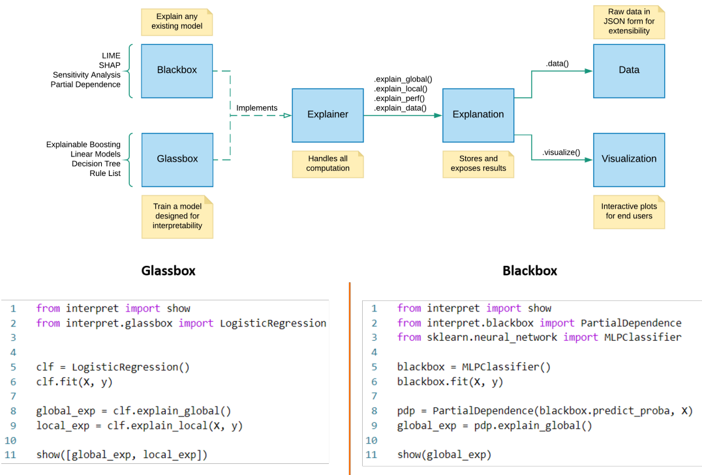

# :books:InterpretML: A Unified Framework for Machine Learning Interpretability
- 오픈 소스 패키지인 InterpretML은 통합 API 아래에 여러 메서드를 표시하고, 확장 가능한 내장 시각화 플랫폼을 사용하여 해석 가능한 알고리즘을 쉽게 비교한다.
- 최초로 설명가능한 부스팅 머신 (Explainable Boosting Machine)을 수행하며 이는 많은 blackbox 모델들 만큼이나 정확하다.

  
---
## :bulb: Introduction
- 통합 API InterpretML은 많은 최신 해석 가능한 알고리즘을 노출함으로써 해석 가능성 문제를 해결한다.
- 본 API는 두 가지의 해석 가능성 form을 다룬다.
    - `Glassbox`: 사용자가 이해하고 설명할 수 있는 모델
    - `Blackbox`: 머신러닝 파이프 라인에 대한 설명을 생성할 수 있는 방법
- 위 두 가지 form은 상호작용이 가능한 시각화와 해석 가능한 알고리즘 비교를 위한 내장 대시보드로 지원된다.
  

---
## :bulb: Explainable Boosting Machine (EBM)이란?
- InterpretML은 패키지 구조 중 하나로 해석 가능한 알고리즘인 EBM을 포함한다.
- EBM은 glassbox 모델로 Random Forest, Boosted Tree와 같은 최첨단 머신러닝 모델에 필적하는 정확도를 가지며 이해가 쉽고, 설명하기 또한 간편하다.
- EBM은 일반화된 가법 모델(eneralized additive model (GAM))이다.
    - 기존의 회귀법: $Y=\beta_0+\beta_1x_1+\beta_0x_2+...$
        - 선형 보델은 해석 가능성이 높지만 복잡한 모델에서 제공하는 높은 정확도를 제공하지 않는 경우가 많다.
    - GAM: $Y=\beta_0+f(x_1)+f(x_2)+...$ => 예측 변수에 대한 각 기여는 함수 $f()$
        - 선형 모델의 문제점을 해결하기 위해 통계학자들은 가법 구조(선형 모델의 상호 확률)를 유지하면서도 더 유연하고 정확하게 만드는 GAM(일반화 가법 모델)을 만들었다.
    - EBM: $Y=\beta_0+f(x_1)+f(x_2)+...$ => $f()$는 배깅 or 부스팅 알고리즘
- `EBM의 작동 방식`
    - 데이터셋에 n개의 feature가 존재한다고 할 때 EBM은 다음과 같이 작동한다.
1. EBM은 feature1만을 기반으로 tree를 생성하고 부스팅 알고리즘을 사용하여 잔차를 다음 tree로 전달한다.
2. 이제 feature2를 보고 잔차를 전달할 수 있는 tree를 훈련시킨다.
3. n개의 feature들에 대해 순차적으로 진행된다.
4. 각 feature에 대한 tree 모델링의 반복과 잔차 전달은 iteration만큼 수행할 수 있다. 
5. 이러한 방식으로 각 feature에 대한 최상의 feature function $f()$를 찾고 각 feature가 문제에 대한 모델의 예측에 어떻게 기여하는지 보여준다.
  
---
## :bulb: EBM과 GAM의 차이점
- EBM은 기존의 GAM 방식과 크게 두 가지 차이점이 있다.
    1. `EBM에서의 feature function $f()$는 최신의 머신러닝 기술인 배깅 혹은 부스팅 알고리즘으로 이루어져 있다.`
    2. `EBM은 자동으로 변수 간의 쌍별 상호작용을 포착하여 반영한다. => 해석력을 주는 동시에 정확도를 증가시킨다.`
- 최종 예측값에 대한 각 feature의 기여도는 $f_j$를 시각화 함으로써 알 수 있기에 매우 쉽게 이해할 수 있다.
- `EBM은 additive model이기 때문에 각 feature는 모듈(additivity) 방식으로 예측에 기여한다.`
- 각 함수 $f_i$는 feature별 조회 테이블 역할과 기여도를 반환한다. 모듈성(가산성)으로 인해 기여도를 정렬하고 시각화하여 개별 예측에 가장 큰 영향을 미친 feature를 표시할 수 있다.
- Individual terms additivity 때문에 EBM은 학습 비용이 더 들어 비슷한 방법론들에 비해 약간 느리다.
- EBM의 가벼운 메모리 사용량과 빠른 예측 시간은 프로덕션 환경에서 모델을 배포하는데 특히 매력적이라고 할 수 있다.

---
### :postbox: Reference
- Paper link: https://arxiv.org/abs/1909.09223
- Reference link: https://medium.com/analytics-vidhya/model-interpretation-with-microsofts-interpret-ml-85aa0ad697ae