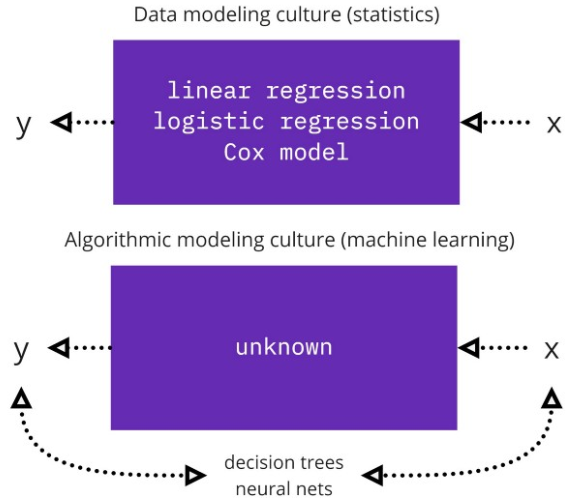

# :bell: XAI
모델의 해석은 ML 모델이 매우 정확하기 때문에 최근에 기계 학습 분야에서 주목을 받았지만 종종 모델이 예측을 할 때 배후에서 무슨 일이 일어나는지 아는 것과 관련이 있다. 해당 주제는 실제로 통계와 기계 학습을 모두 포함하므로 이론적인 논의에 대해 먼저 알아보겠다.

고전 통계는 기술 및 추론으로 분류할 수 있다. `기술 통계`는 관찰된 표본 데이터 탐색을 다루는 반면 `통계적 추론`은 어떤 형태의 표본 추출을 통해 모집단에서 가져온 데이터를 사용하여 모집단에 대한 명제를 만드는 것과 관련된다.

통계 모델링 분야는 다음과 같은 두 개의 커뮤니티로 분리될 수 있다.(Leo Breiman, 2001)
1. `데이터 모델링`: 확률적 데이터 모델이 있다는 가정에 의존 하며 일반적으로 데이터에서 매개변수를 추정하고 정보를 위해 모델을 사용하는 데 중점을 둔다.
2. `알고리즘 모델링`: 데이터 메커니즘을 알 수 없는 것으로 취급하며 입력 변수 x는 응답 변수 y를 예측하는 데 사용된다. 평가는 예측 정확도를 기반으로 한다.

`머신 러닝은 모델 성능에 관심을 갖지만 설명 가능성은 학습 정보 범주(첫 번째 컨뮤니티)에 속한다.` 

---
### :postbox: Reference
- Link: https://medium.com/@mariusvadeika/explaining-model-pipelines-with-interpretml-a9214f75400b
